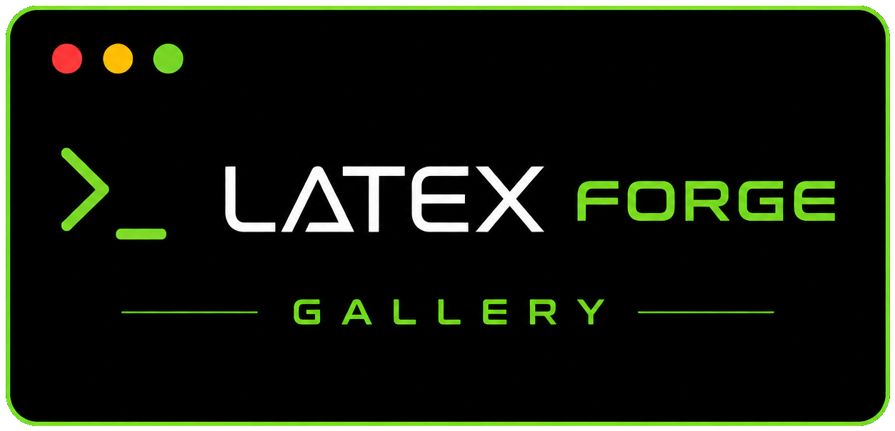

# LaTeX Forge Gallery

<p align="center">
  
</p>

<p align="center">
  Browse and install 80 curated LaTeX templates in one command.
</p>

<p align="center">
  <a href="https://thmsgo18.github.io/latex-forge-gallery/"></a>
  <a href="https://github.com/thmsgo18/latex-forge"></a>
  
  <a href="LICENSE"></a>
</p>

<p align="center">
  <a href="./README.fr.md">Lire en français</a>
</p>

---

LaTeX Forge Gallery is the official template registry for [latex-forge](https://github.com/thmsgo18/latex-forge). Each template is curated, tested, and structured with a `main.tex` at its root — ready to install and compile immediately.

Browse the full gallery at **[thmsgo18.github.io/latex-forge-gallery](https://thmsgo18.github.io/latex-forge-gallery/)**.

## Installation

Install any template in one command:

```bash
latex-forge template install https://github.com/thmsgo18/latex-forge-gallery/tree/main/templates/<category>/<template-name>
```

**Example:**

```bash
latex-forge template install https://github.com/thmsgo18/latex-forge-gallery/tree/main/templates/cv/awesome-cv
```

## Templates

### CV / Resume

| Name | Description | Engine |
|------|-------------|--------|
| `awesome-cv` | Elegant CV with colored sections and FontAwesome icons | XeLaTeX |
| `deedy-resume` | Two-column resume with a clean, professional layout | XeLaTeX |
| `altacv` | CV with TikZ skill bars and timeline | LuaLaTeX |
| `moderncv` | Highly customizable CV with multiple styles | pdfLaTeX |
| `hipster-cv` | Colorful sidebar CV design | XeLaTeX |
| `twenty-seconds-cv` | Sidebar CV designed to be skimmed in 20 seconds | pdfLaTeX |
| `developer-cv` | Academic CV with automatic BibTeX publication list | pdfLaTeX |
| `sidebar-cv` | Modern CV with styled sidebar | pdfLaTeX |
| `friggeri-cv` | Stylish A4 CV with colored section bars and BibTeX publications | XeLaTeX |
| `resume-openfont` | Minimalist single-page resume using open-source fonts | pdfLaTeX |
| `billryan-resume` | Elegant bilingual (English/Chinese) resume with FontAwesome | XeLaTeX |
| `mcdowell-cv` | McDowell-style ATS-friendly CV | pdfLaTeX |
| `rover-resume` | ATS-friendly resume with unique styling | pdfLaTeX |
| `classic-cv` | Traditional single-column CV | pdfLaTeX |
| `two-column-cv` | Two-column CV with photo and QR code | pdfLaTeX |
| `infographic-cv` | Infographic-style CV with visual skill bars | XeLaTeX |
| `minimalist-cv` | Ultra-minimalist single-page CV | pdfLaTeX |
| `modern-cv` | Modern CV with colored sidebar and skill bars | XeLaTeX |
| `rows-cv` | Row-based CV layout with clean horizontal sections | XeLaTeX |
| `sidebarleft-cv` | CV with left-aligned sidebar and icon-based contact info | XeLaTeX |
| `infographics2-cv` | Second infographic-style CV with visual skill bars and timeline | XeLaTeX |
| `cv-en` | Modern English CV by thmsgo18 with FontAwesome icons, covering education, experience, projects and skills | LuaLaTeX |
| `cv-fr` | Modern French CV by thmsgo18 with FontAwesome icons | LuaLaTeX |

### Thesis / Dissertation

| Name | Description | Engine |
|------|-------------|--------|
| `clean-thesis` | Clean, simple, and elegant thesis style | pdfLaTeX |
| `cambridge-thesis` | PhD thesis template for Cambridge University | pdfLaTeX |
| `memoir-thesis` | Professional dissertation with polished typography | pdfLaTeX |
| `dissertate` | Pre-formatted templates for Harvard, Princeton, and NYU | XeLaTeX |
| `tufte-thesis` | Elegant book-style thesis inspired by Edward Tufte | pdfLaTeX |
| `mimosis-thesis` | Beautiful minimalist thesis with elegant typography | pdfLaTeX |
| `oxford-thesis` | PhD thesis template for the University of Oxford | pdfLaTeX |
| `tuda-thesis` | Official TU Darmstadt thesis following university corporate design | pdfLaTeX |

### Academic Article / Paper

| Name | Description | Engine |
|------|-------------|--------|
| `neurips-paper` | Scientific paper template for modern academic conferences | pdfLaTeX |
| `ieee-article` | IEEE-style article using IEEEtran class | pdfLaTeX |
| `acm-article` | LNCS/Springer-style article for CS conferences | pdfLaTeX |
| `cvpr-paper` | CVPR/ICCV paper template, up-to-date for 2026 | pdfLaTeX |
| `arxiv-template` | Clean arXiv-style preprint template | pdfLaTeX |
| `elsarticle` | Elsevier CAS journal article template | pdfLaTeX |
| `springer-lncs` | Enhanced Springer LNCS article template for CS conferences | pdfLaTeX |
| `elegantpaper` | Elegant working paper and preprint template | pdfLaTeX |
| `research` | Two-column academic research article by thmsgo18, with related work, methodology and experiments | LuaLaTeX |

### Report

| Name | Description | Engine |
|------|-------------|--------|
| `elegant-report` | Clean and elegant report with bibliography support | pdfLaTeX |
| `technical-report` | Professional technical/term paper template | pdfLaTeX |
| `internship-report` | UTBM-style internship report with professional formatting | pdfLaTeX |
| `project-report` | Academic project report with certificate pages | pdfLaTeX |
| `math-notes` | Minimalist math notes with theorem environments | pdfLaTeX |
| `elegant-notes` | Beautiful note-taking template with theorem environments | pdfLaTeX |
| `homework-template` | Clean university homework template with problem/solution environments | pdfLaTeX |
| `lab-report` | Laboratory report template in article style | pdfLaTeX |
| `essay-collection` | Multi-essay collection report with individual abstracts and bibliography | pdfLaTeX |
| `project-report-en` | University project report by thmsgo18, with requirements, architecture, testing and bibliography (ISO/IEEE style) | LuaLaTeX |
| `project-report-fr` | University project report in French by thmsgo18, with specs, architecture and tests (AFNOR/ISO style) | LuaLaTeX |

### Beamer Presentation

| Name | Description | Engine |
|------|-------------|--------|
| `beamer-metropolis` | Modern, minimal Beamer theme | XeLaTeX |
| `beamer-focus` | Minimalist Beamer theme with dark color scheme | pdfLaTeX |
| `beamer-elegant` | Elegant Beamer slides with figure support | pdfLaTeX |
| `beamer-corporate` | Professional Beamer slides with configurable colors | pdfLaTeX |
| `beamer-simple` | Simple Beamer template focused on content | pdfLaTeX |
| `beamer-auriga` | Dark-themed Beamer presentation with a modern, polished look | pdfLaTeX |

### Letter

| Name | Description | Engine |
|------|-------------|--------|
| `cover-letter-modern` | Modern cover letter with clean typography | XeLaTeX |
| `formal-letter` | Journal-style cover letter with professional formatting | pdfLaTeX |
| `motivation-letter` | Motivation letter for academic and job applications | pdfLaTeX |
| `moderncv-letter` | Cover letter using the moderncv class | pdfLaTeX |

### Academic Poster

| Name | Description | Engine |
|------|-------------|--------|
| `beamerposter-landscape` | Landscape academic poster built with Beamer | pdfLaTeX |
| `tikzposter` | Academic poster using TikZposter | pdfLaTeX |
| `academic-poster` | Gemini-themed academic conference poster | pdfLaTeX |
| `gemini-poster` | Gemini beamerposter template with clean, modern design | pdfLaTeX |

### Book

| Name | Description | Engine |
|------|-------------|--------|
| `elegantbook` | Elegant book template with beautiful chapter styling | XeLaTeX |
| `legrand-orange-book` | Structured book template with color-coded chapters | XeLaTeX |

### Cheatsheet

| Name | Description | Engine |
|------|-------------|--------|
| `cheatsheet` | Compact multi-column cheatsheet template for quick reference cards | pdfLaTeX |

### Miscellaneous

| Name | Description | Engine |
|------|-------------|--------|
| `invoice-simple` | Clean single-page invoice template using the scrlttr2 class | pdfLaTeX |
| `invoice-multipage` | Multi-page invoice template with itemized table and totals | pdfLaTeX |
| `timesheet` | Monthly timesheet template with daily hours tracking table | pdfLaTeX |
| `poem` | Elegant poem typesetting template with verse environments | pdfLaTeX |

### Projet Informatique L3 — Université Paris Cité

8 templates for the standard documents of the L3 Computer Science Project at Université Paris Cité. UPC visual identity, fully in French, compiled with pdfLaTeX.

| Name | Description |
|------|-------------|
| `upc-cahier-des-charges` | Requirements specification |
| `upc-rapport-final` | Final report |
| `upc-conception-detaillee` | Detailed design |
| `upc-manuel-installation` | Installation manual |
| `upc-manuel-utilisation` | User manual |
| `upc-rapport-tests` | Test report |
| `upc-documentation-technique` | Technical documentation |
| `upc-cahier-recette` | Acceptance test plan |

## Compatibility

Every template contains a `main.tex` at the root of its directory, making it fully compatible with [latex-forge](https://github.com/thmsgo18/latex-forge).

## Contributing

Want to add a template? Read [CONTRIBUTING.md](CONTRIBUTING.md) for the full guide — it covers the required directory structure, standard placeholders, engine declaration, `gallery.json` format, and how to generate previews.

In short: your template needs a `main.tex`, a `frontmatter/metadata.tex` with standard placeholders, and a `latexforge.toml` if it doesn't use LuaLaTeX.

## Sources

All templates are sourced from publicly available GitHub repositories with permissive licenses. Full credit goes to their original authors. See [SOURCES.md](SOURCES.md) for the complete list.

## License

The gallery structure, scripts, and tooling are licensed under the [MIT License](LICENSE).  
Each template retains its original license (MIT, Apache 2.0, LPPL, CC BY/BY-SA/BY-NC-SA).

---

Made by [thmsgo18](https://github.com/thmsgo18)
